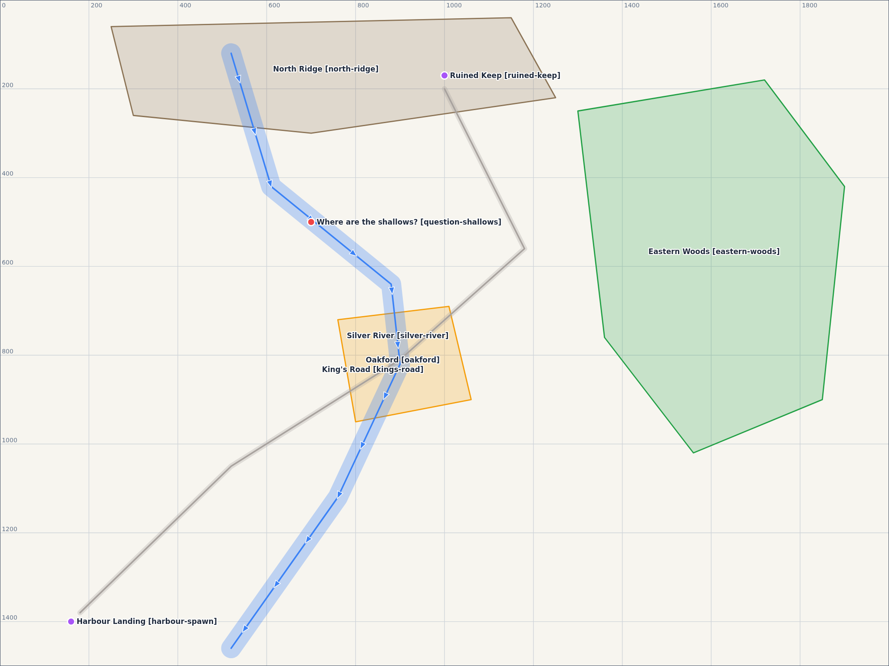

# Map Annotator

A local, 2D, single-level **map annotation tool** for laying out large-scale maps, on top of your own
reference images if you like (a terrain drawing, a sketch, a map screenshot): which areas are
what, where a river flows, where the roads run, what each place should feel like. It is
built so that **AI agents (like Claude) can read and write the same document** you're editing.

It has nothing to do with any particular game engine or modelling tool. The output is a design
document, and whoever or whatever builds the map reads that.



## Quick start

Requires Node.js 18+. There are no dependencies to install.

```sh
git clone https://github.com/okeanskiy/map-annotating
cd map-annotating
node bin/mapdoc.js serve ~/maps/my-map      # creates the folder if needed
# open http://127.0.0.1:4178
```

Try the example: `npm run example`.

Optionally run `npm link` to get a global `mapdoc` command.

## The map folder

```
my-map/
  map.json        ← the document (single source of truth)
  preview.png     ← rendered image of everything, updated by the editor while it's open
  *.png / *.jpg   ← image layers you added (terrain drawings, screenshots…)
  AGENTS.md       ← format + workflow guide for agents
  CLAUDE.md       ← points Claude Code at AGENTS.md
```

## Using it with an agent

Open Claude Code (or any agent) **in the map folder**. It picks up `CLAUDE.md` / `AGENTS.md`
and knows the format. Keep the editor open next to it:

- Ask things like _"read the map and tell me what's unclear"_, _"add a lake where the river ends"_,
  or _"split Oakford into three districts"_. The agent edits `map.json` and the editor redraws live.
- Agents can pin questions to the map as red `note` points.
- Undo in the editor (Ctrl+Z) also reverts agent edits.
- If an agent writes an invalid file, the editor pauses and shows the errors instead of overwriting it.

CLI helpers for agents and scripts:

| Command                    |                                                                                          |
| -------------------------- | ---------------------------------------------------------------------------------------- |
| `mapdoc describe <folder>` | Text summary: every feature with size, position, notes, and what's inside / crosses what |
| `mapdoc validate <folder>` | Checks `map.json`; exit code 1 on errors                                                 |
| `mapdoc guide`             | Prints the full format + workflow guide ([docs/AGENT_GUIDE.md](docs/AGENT_GUIDE.md))     |
| `mapdoc init <folder>`     | New map folder (`--name`, `--width`, `--height`, `--units`)                              |

## Editor basics

- **Tools:** Select `V`, Area `A`, Line `L`, Point `P`. "Draw as" sets the category of new shapes.
- **Draw:** click to add points. Double-click, `Enter` or right-click finishes; `Esc` cancels.
- **Edit:** drag a shape to move it, drag vertices to reshape it, click a midpoint dot to add a vertex,
  and Alt+click a vertex to remove it. Use `Delete` to remove the selected shape.
- **Images:** click **▣ Image**, paste one (`Ctrl+V`, e.g. a Google Maps screenshot) or drop files onto
  the map. Images always sit beneath the annotations and appear in `preview.png`.
  - The first image added to an empty map becomes a locked base layer, and the map frame is sized to fit it.
  - Other images are placed in view, unlocked. Drag an image to move it and drag its corners to
    resize it (hold `Shift` to stretch it out of proportion), then tick **Locked** so clicks pass through it.
  - The inspector has exact position, size and opacity, plus "Fit into map frame" and "Set map frame to image".
- **View:** the canvas and grid are unbounded. Scroll to zoom. Drag empty space, hold Space and drag, or use the
  middle mouse button to pan. `F` fits everything into view.
- **Inspector:** name, id, category, notes, color, line width/direction, and free-form properties.
  With nothing selected, it shows map settings: name, notes, frame size, units and categories.

Coordinates: +x is east and +y is south, in whatever `units` you choose. The map frame runs from `(0, 0)` to
`(width, height)` and marks the intended play area.

## Development

```sh
npm test          # unit + server tests (node:test)
```

- `public/`: the editor (plain ES modules + SVG, no build step)
- `public/js/model.js`: document format, validation, geometry and descriptions (shared by browser, server and CLI)
- `src/server.js`: local HTTP server, file watching, live updates over SSE
- `bin/mapdoc.js`: CLI
